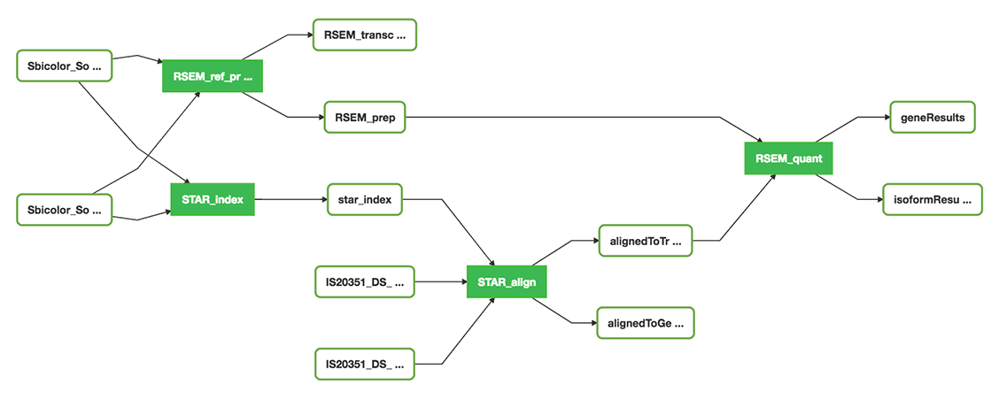

# ENCODE expression workflow

* Wrapper scripts used for building the expression workflow
  * [star-index.sh](star-index.sh) with corresponding app json: [STAR_index-2.5.3.json](../../assets/STAR_index-2.5.3.json)
  * [star-align.sh](star-align.sh) with corresponding app json: [STAR_align-2.5.3.json](../../assets/STAR_align-2.5.3.json)
  * [rsem-index.sh](rsem-index.sh) with corresponding app json: [RSEM_ref_prepare-1.3.0.json](../../assets/RSEM_ref_prepare-1.3.0.json)
  * [rsem-quant.sh](rsem-quant.sh) with corresponding app json: [RSEM_quant-1.3.0.json](../../assets/RSEM_quant-1.3.0.json)
* Job submission json files for testing
  * [test-STAR-index-job.json](test-STAR-index-job.json)
  * [test-STAR_align-job.json](test-STAR_align-job.json)
* Workflow json file that can be loaded at https://de2.sciapps.org (local)
  * [encode_rnaseq_workflow.json](https://cdn.rawgit.com/warelab/maizecode/1e3c16c1/wrappers/rna-seq_workflow/encode_rnaseq_workflow.json)
* Screenshot of the workflow

